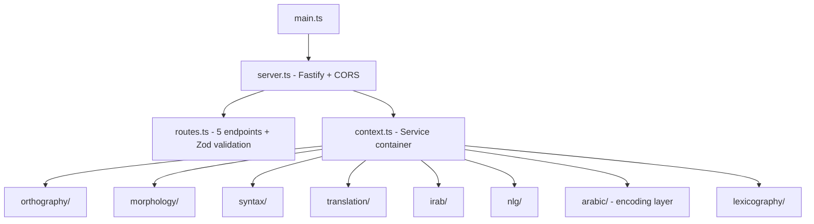

# Code Review: API Port — Java/Micronaut → TypeScript/Fastify

## Architecture Overview

## What Went Well ✅

| Area | Details |
|------|---------|
| **Modular structure** | 1:1 mapping from Java packages to TS module directories. 80 source files across 10 domain modules — faithfully mirrors the original 88 Java files |
| **Zod validation** | All 5 endpoints use typed Zod schemas (`morphologyQuerySchema`, `locationQuerySchema`, `syntaxQuerySchema`, `irabQuerySchema`) with coercion for query params |
| **DI via context** | `context.ts` — clean service wiring with `ReturnType<typeof buildContext>` for full type inference. No DI framework needed |
| **TypeScript strictness** | `noUncheckedIndexedAccess`, `exactOptionalPropertyTypes`, `verbatimModuleSyntax` — very strict config, catches real bugs |
| **Test coverage** | 4 test files: `api.test.ts`, `api-parity-extra.test.ts`, `morphology-parity.test.ts`, `ordinal.test.ts`. Parity tests round-trip against raw data files for correctness |
| **Modern tooling** | Vitest, `tsx watch` for dev, ESM-native (`"type": "module"`) |
| **Feature parity** | Tests assert exact output (e.g., Arabic grammar text, segment positions, graph navigation) proving byte-for-byte parity with the Java service |
| **Deploy scripts** | Both `deploy.sh` and `prod/` scripts are production-ready |

## Observations & Suggestions 📝

1. **Routes file size** — `routes.ts` is 245 lines doing routing, validation, and response assembly in one file. Consider splitting into route-level handler files (e.g., `morphology.handler.ts`, `syntax.handler.ts`) for maintainability as the API grows.

2. **Typed response helpers** — `getVerseResponse()` at line 192 uses `any` for the `verse` parameter's `tokens` field. This breaks the strict typing you've established elsewhere. Consider defining a proper `Verse` type from the document model.

3. **Error handling consistency** — Validation errors return `{ message }` but the `null` return from `/syntax` (line 107) returns a `200 null` body. Consider using `204 No Content` or a consistent error envelope.

4. **Missing health/readiness endpoint** — No `/health` or `/ready` endpoint. For production deployments behind a load balancer, this is useful.

5. **CORS config** — `origin: true` accepts all origins. Fine for development but consider restricting for production.

6. **No rate limiting** — The `/irab` endpoint already caps at 20 results, but there's no global rate limiting. Something to consider for production.

## Grade: **A**

The Java → TypeScript port is excellent. The module structure mirrors the original faithfully, the TypeScript config is pleasingly strict, and the parity test suite proves output correctness against the Java implementation. Zod validation is well-applied. The codebase is production-ready with deploy scripts and documentation.

## Priority Improvements

| Priority | Item | Effort |
|----------|------|--------|
| 🟡 Medium | Fix `any` types in routes file | Low |
| 🟢 Low | Add `/health` endpoint | Low |
| 🟢 Low | Split routes into handler modules | Low |
